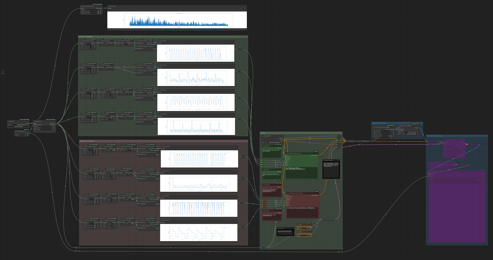

# ComfyUI-AudioScheduler

Features:
- Loading mp3 or wav files
- Reading the amplitude over time
- Previewing the shape of the graph

This repository contains a collection of audio processing nodes that are part of the AudioScheduler project. These nodes can be used to perform various operations on audio data, such as loading audio, performing Fast Fourier Transforms (FFTs), and manipulating amplitude data.  You can use them to control animations in your AI generation

# Examples

# Nodes

## LoadAudio

**Input Types:**

- `audio`: A list of audio file names to be loaded. Supported formats: mp3, wav.

**Output Types:**

- `AUDIO`: Loaded audio data.

**Description:**

The `LoadAudio` class is responsible for loading audio files from a specified directory. It supports both MP3 and WAV formats and returns the loaded audio data.

## AudioToFFTs

**Input Types:**

- `audio`: An instance of loaded audio data.
- `channel`: An integer specifying the audio channel.
- `frames_per_second`: An integer specifying the number of frames per second.

**Output Types:**

- `AUDIO_FFT`: Fast Fourier Transform data for the specified audio channel.
- `INT`: Total number of frames.

**Description:**

The `AudioToFFTs` class performs FFT on the audio data to obtain frequency information. You can specify the channel, frames per second, and other parameters.

## AudioToAmplitudeGraph

**Input Types:**

- `audio`: An instance of loaded audio data.
- `channel`: An integer specifying the audio channel.
- `lower_band_range`: An integer specifying the lower band range.
- `upper_band_range`: An integer specifying the upper band range.

**Output Types:**

- `IMAGE`: A graph displaying the amplitude in the specified frequency range.

**Description:**

The `AudioToAmplitudeGraph` class creates a graph of the amplitude in a specified frequency range for visualization purposes.

## BatchAmplitudeSchedule

**Input Types:**

- `audio_fft`: A list of FFT data.
- `operation`: A string specifying the operation (avg, max, sum).
- `lower_band_range`: An integer specifying the lower band range.
- `upper_band_range`: An integer specifying the upper band range.

**Output Types:**

- `AMPLITUDE`: Amplitude data.

**Description:**

The `BatchAmplitudeSchedule` class calculates amplitude values from FFT data based on the specified operation and frequency range.

## NormalizeAmplitude

**Input Types:**

- `amplitude`: Amplitude data.

**Output Types:**

- `NORMALIZED_AMPLITUDE`: Normalized amplitude data.

**Description:**

The `NormalizeAmplitude` class normalizes the amplitude data, optionally inverting the normalized values.

## GateNormalizedAmplitude

**Input Types:**

- `normalized_amp`: Normalized amplitude data.
- `gate_normalized`: A float value (0.0 to 1.0) for gating.

**Output Types:**

- `NORMALIZED_AMPLITUDE`: Gated normalized amplitude data.

**Description:**

The `GateNormalizedAmplitude` class gates the normalized amplitude data based on the specified threshold.

## NormalizedAmplitudeToNumber

**Input Types:**

- `normalized_amp`: Normalized amplitude data.

**Output Types:**

- `FLOAT`: Normalized amplitude values as floats.
- `INT`: Normalized amplitude values as integers.

**Description:**

The `NormalizedAmplitudeToNumber` class converts normalized amplitude data to float or integer values.

## NormalizedAmplitudeToGraph

**Input Types:**

- `normalized_amp`: Normalized amplitude data.

**Output Types:**

- `IMAGE`: A graph displaying the normalized amplitude data.

**Description:**

The `NormalizedAmplitudeToGraph` class generates a graph to visualize the normalized amplitude data.

## AmplitudeToNumber

**Input Types:**

- `amplitude`: Amplitude data.

**Output Types:**

- `FLOAT`: Amplitude values as floats.
- `INT`: Amplitude values as integers.

**Description:**

The `AmplitudeToNumber` class converts amplitude data to float or integer values.

## AmplitudeToGraph

**Input Types:**

- `amplitude`: Amplitude data.

**Output Types:**

- `IMAGE`: A graph displaying the amplitude data.

**Description:**

The `AmplitudeToGraph` class generates a graph to visualize the amplitude data.

Feel free to explore and use these nodes for your audio processing tasks. Detailed documentation for each node is available within the code and can be accessed as needed.
